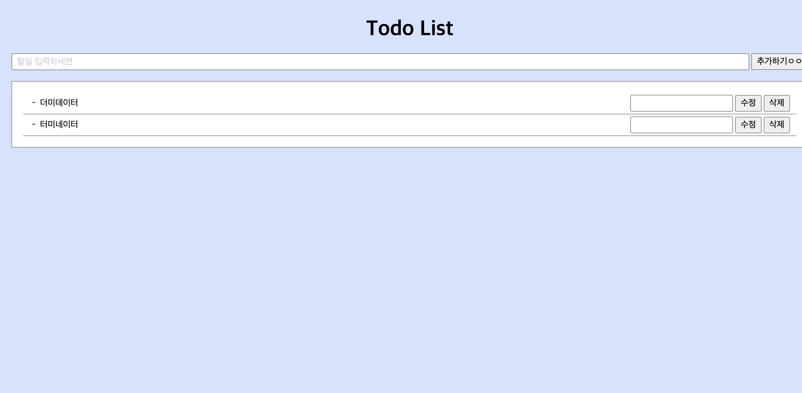
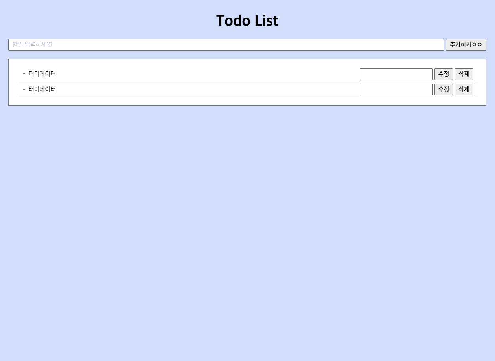
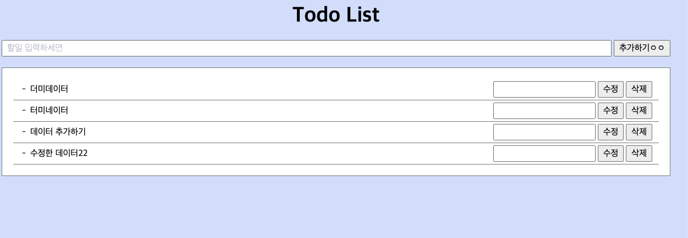

## Node.js를 사용한 간단한 투두리스트입니다.

CRUD기능만 들어있습니다.

### node-server

기본적인 fetch를 사용하여 구현한 코드입니다.

- Create,Read,Update,Delete
- 서버 오픈

### node-express

- Create,Read,Update,Delete
- 서버 오픈
- express,cors 라이브러리를 사용하여 구현

```
1.cd node-server or cd node-express
2.npm install
3.node server.js
4.html을 열고 GoLive(vscode 익스텐션)로 키면 됩니다.
```

  
